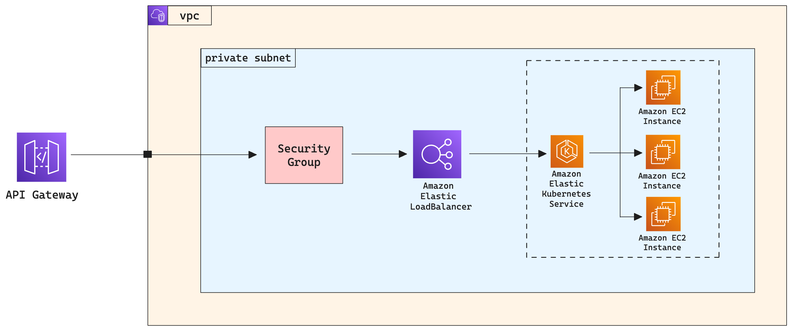

# Build and Run Application on AWS
Practical example of a layered infrastructure setup.  
With this approach the application will have several layers of resources:

* IAM resources
* VPC + Subnets + NAT GW + Internet GW + Route tables + Security Groups
* Route53 zone + Records
* ACM certificates
* API Gateway
* Elastic Kubernetes Service
* Elastic Container Registry
* Istio service mesh
* K8s manifests
* CodeBuild projects to run automation tasks backed with Arranger

## AWS Resources Diagram

